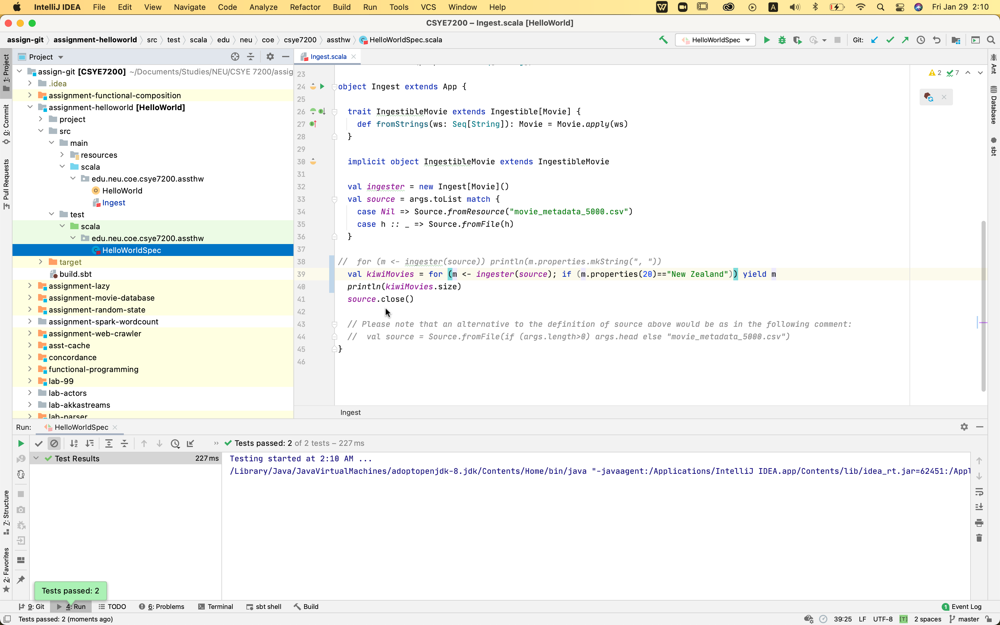
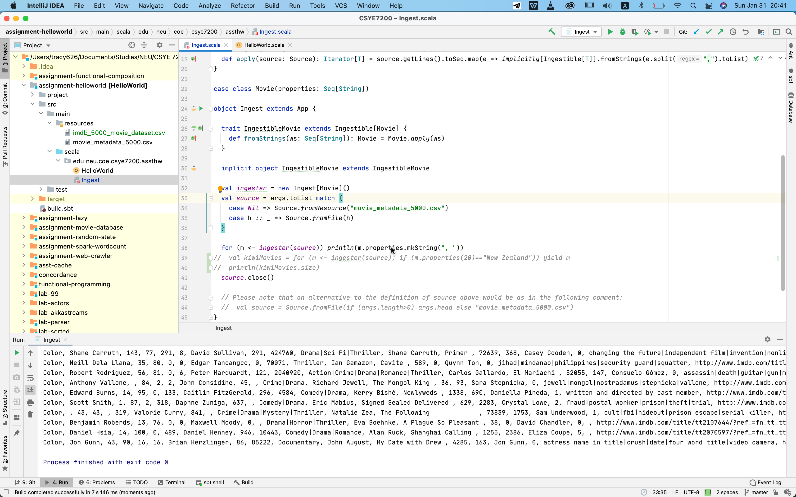
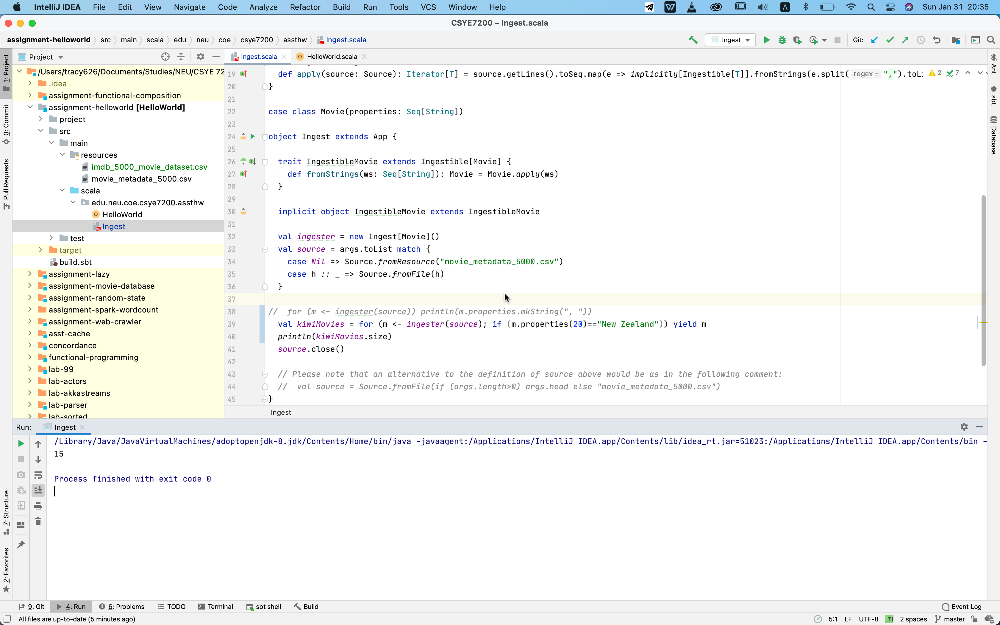

##Report of Assignment HelloWorld

####Sceenshot of Unit Test:

####Output of Ingest:
By providing the argument of file “imdb_5000_movie_dataset.csv”

Get all movies details:

Replace the code in line 38, get the result **15**:
