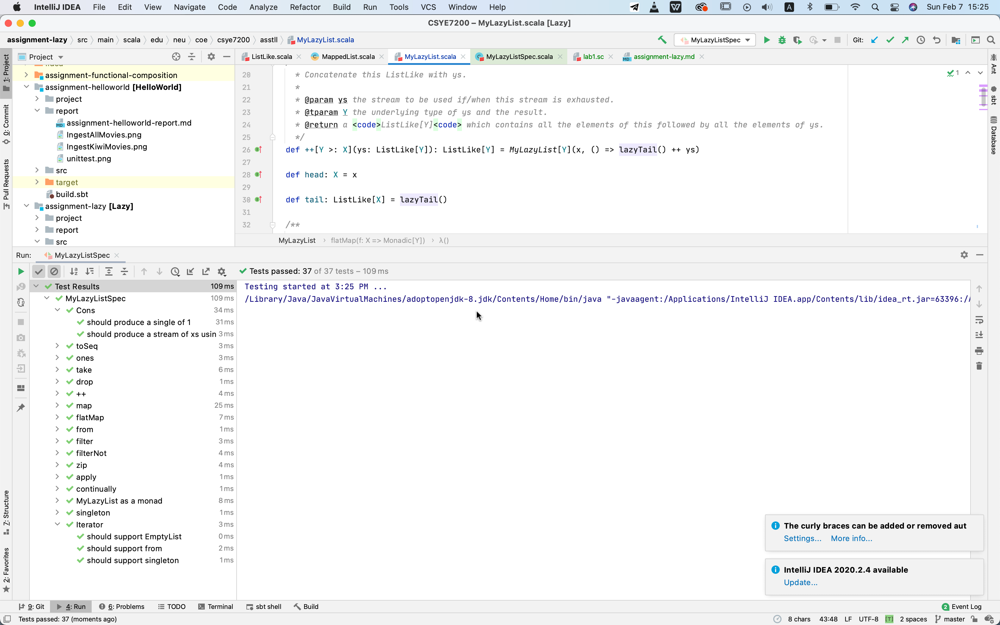
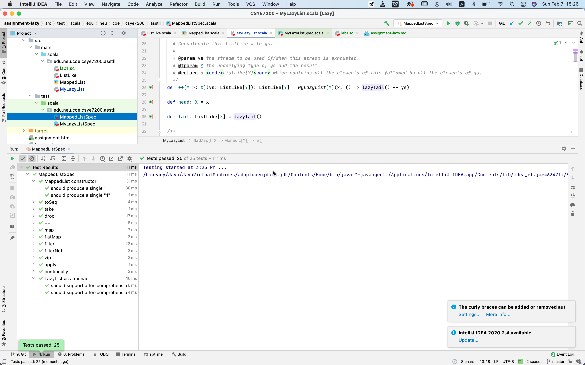

## Report of Assignment Lazy

#### Sceenshot of Unit Test:
MyLasyListTest:

MappedListTest:

#### Answers for Question on Canvas:
1. (a) MyLazyList extends from LazyListLike(which extends ListLike), defined in case of EmptyList and non-empty ListLike

    (b) Whether the built-in LazyList is empty or not can be initially unknown, however the size of MyLazyList will be 0
    , if it is EmptyList. Also, some values specified for EmptyList.
2. Define the tail in MyLazyList. The tail also should be a lazy list and elements in tail can be accessed only when the 
tail is called.
3. line 26, line 43, line 70, line 82, line 98, line 116, line 131, line 170, line 361, line 372, line 383, line 408
4. line 130, line 168, line 302, line 359, line 372
5. Combine (this) ListLike with the target ListLike and return with the list of Tuples, each Tuple contains two elements
from the origin ListLikes with the same index.
6. Since the elements will not be evaluated unless needed, the size of the whole list will not be available in lazy
 list.
